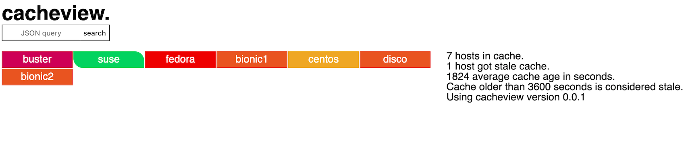

# cacheview

`cacheview` is a basic [Ansible](https://www.ansible.com/) cache viewer using
[python](https://www.python.org/), [MongoDB](https://www.mongodb.com/)
and the [Flask](https://palletsprojects.com/p/flask/) framework.



## Configuration

[Flask’s built-in server is not suitable for production](https://flask.palletsprojects.com/en/1.1.x/deploying/)
and the MongoDB connection does not use any form of authentication or encrypted
communication.

Handle with care, and don't allow connections from other IP
addresses than `127.0.0.1` unless there's proper protection and a configured
server in place.

### cacheview.cfg

```sh
CACHEVIEW_HOST=127.0.0.1
CACHEVIEW_PORT=5000
CACHE_STALE_SECONDS=3600
FLASK_TEST=0
MONGODB_HOST=127.0.0.1
MONGODB_PORT=27017
```

`CACHEVIEW_HOST` is the listening IP address.

`CACHEVIEW_PORT` configures the listening port.

`CACHE_STALE_SECONDS` is the number of seconds before we consider a cache entry old.

`FLASK_TEST` will create 150 fake nodes for layout testing if set to `1`.

`MONGODB_HOST` is the MongoDB server IP address.

`MONGODB_PORT` is the listening port of the MongoDB server.

### ansible.cfg

Ansible MongoDB cache plugin documentation is available at
[https://docs.ansible.com/ansible/latest/plugins/cache/mongodb.html](https://docs.ansible.com/ansible/latest/plugins/cache/mongodb.html)

```dosini
[defaults]
fact_caching = mongodb
fact_caching_timeout = 86400
fact_caching_connection = mongodb://localhost:27017/ansible_cache
```

#### MongoDB in Docker

```sh
docker run --cap-drop=all --cap-add={audit_write,setgid,setuid} --publish=127.0.0.1:27017:27017 --name "ansible_mongodb" -d konstruktoid/mongodb
docker exec -ti ansible_mongodb mongo --eval 'rs.initiate()'
```

### Website routes

```python
@app.route("/")
@app.route("/info")
@app.route("/node/<hostname>")
@app.route("/result", methods=["POST", "GET"])
```

## Usage

### Building and running

```sh
pip3 install -r ./requirements.txt
cd cacheview/
python3 cacheview.py
```

### Building and running using Docker

```sh
docker build --no-cache --tag konstruktoid/cacheview:latest \
  --tag konstruktoid/cacheview:$(awk -F '"' '{print $2}' cacheview/version.py) \
  -f Dockerfile .
```

```sh
docker run -d --cap-drop=all --publish=127.0.0.1:5000:5000 konstruktoid/cacheview:latest
```

### Queries

`cacheview` supports queries similar to those used with MongoDB, e.g.
`{"data.ansible_os_family": "RedHat"}`, and will output a full JSON dump of any
result or return an exception.

## Contributing

Do you want to contribute? That's great! Contributions are always welcome,
no matter how large or small. If you found something odd, feel free to submit a
issue, improve the code by creating a pull request, or by
[sponsoring this project](https://github.com/sponsors/konstruktoid).
